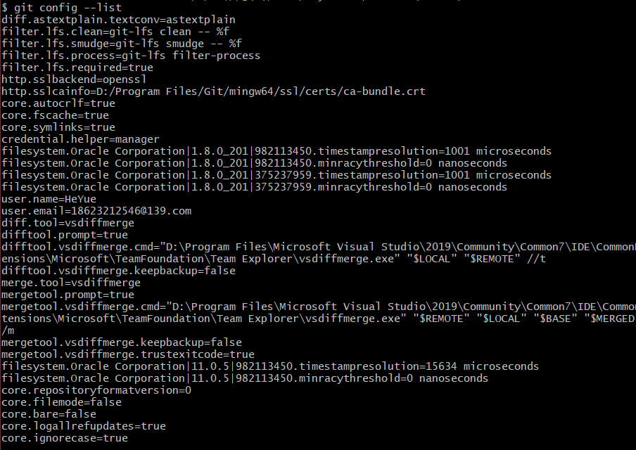
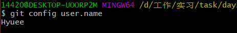
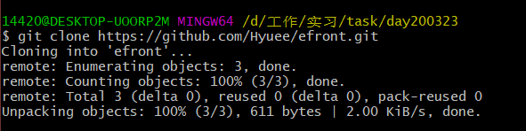
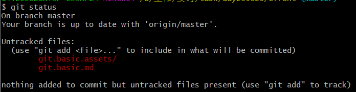
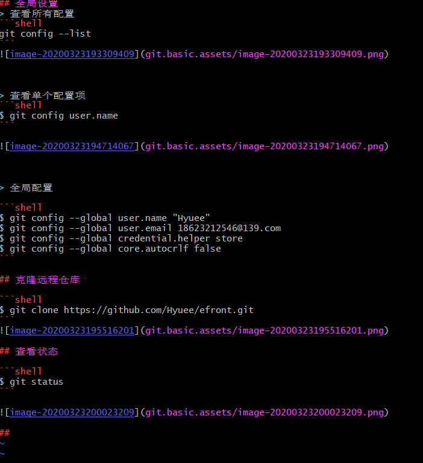
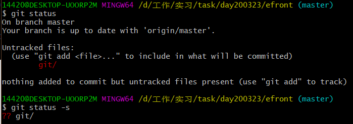
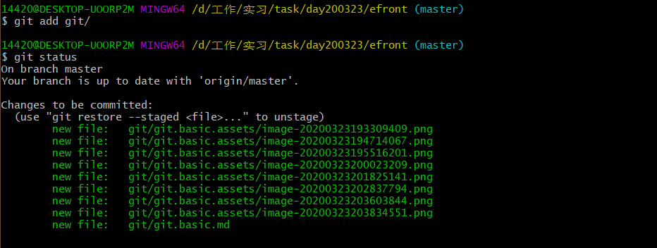
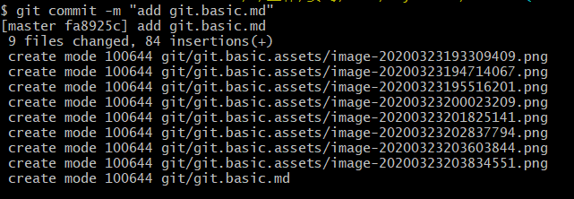
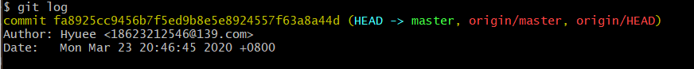

# Git基础练习

## 全局设置
> 查看所有配置
```shell
git config --list
```



> 查看单个配置项
```shell
$ git config user.name
```




> 全局配置

```shell
$ git config --global user.name "Hyuee"
$ git config --global user.email 18623212546@139.com
$ git config --global credential.helper store
$ git config --global core.autocrlf false
```

## 克隆远程仓库

```shell
# 克隆远程项目（名称默认为远程仓库名）
$ git clone https://github.com/Hyuee/efront.git
# 克隆远程项目（自定义克隆后的名称为demo）
$ git clone https://github.com/Hyuee/efront.git demo
```


## 查看状态

```shell
$ git status
```



## 文件操作

```shell
# 创建文件夹
$ mkdir git
# 列出当前目录下的文件
$ ls -l
# 切换目录
$ cd git
# 复制文件或目录 + 目标目录（-i若目标档已经存在时，在覆盖时会先询问）
$ cp -i git.basic.md git
# 移除文件或者目录
$ rm git.basic.md git
# 移动文件或者目录
$ mv -i git.basic.md git
# 编辑文件, i键插入，esc :wq 保存退出
$ vim git.basic.md
```



## 再次查看状态

```shell
# 查看详细状态
$ git status
# 查看简洁状态信息
$ git status -s
```



## 将文件添加到暂存区

```shell
# 暂存已修改的文件
$ git add git/
```




## 将暂存区文件提交到本地仓库

```shell
# -m + 提交的信息
$ git commit -m "add git.basic.md"
# 跳过暂存区（提交所有修改的文件），直接提交
$ git commit -a -m 'add git.basic.md'
```




## 推送到远程仓库

```shell
# 第一次提交需要加上 --set-upstream
$ git push --set-upstream origin master
```


## 查看历史

```shell
$ git log
```




## 从远程仓抓取数据

```shell
$ git pull

remote: Enumerating objects: 4, done.
remote: Counting objects: 100% (4/4), done.
remote: Compressing objects: 100% (2/2), done.
remote: Total 3 (delta 0), reused 0 (delta 0), pack-reused 0
Unpacking objects: 100% (3/3), 691 bytes | 2.00 KiB/s, done.
From https://github.com/Hyuee/efront
   fa8925c..aad3f5e  master     -> origin/master
Updating fa8925c..aad3f5e
Fast-forward
 test.md | 1 +
 1 file changed, 1 insertion(+)
 create mode 100644 test.md

# 查看文件列表
$ ls -l
total 2
drwxr-xr-x 1 14420 197609  0  3月 23 21:06 git/
-rw-r--r-- 1 14420 197609 30  3月 23 19:54 README.md
-rw-r--r-- 1 14420 197609 18  3月 23 21:02 test.md

```


## 修改文件

```shell
$ vim test.md

diff --git a/test.md b/test.md
index 307215a..1f4f845 100644
--- a/test.md
+++ b/test.md
@@ -1 +1,3 @@
 test pull command
+
+git diff HEAD
```

## 加入暂存区

```shell
14420@DESKTOP-UOORP2M MINGW64 /d/工作/实习/task/day200323/efront (master)
$ git add -A

14420@DESKTOP-UOORP2M MINGW64 /d/工作/实习/task/day200323/efront (master)
$ git status -s
A  git/git.basic.assets/image-20200323204036513.png
A  git/git.basic.assets/image-20200323204746430.png
A  git/git.basic.assets/image-20200323205341581.png
A  git/git.basic.assets/image-20200323205603788.png
M  git/git.basic.md
M  test.md
```

## 查看暂存区与本地库之间的差异

```shell
$ git diff --staged

diff --git a/git/git.basic.assets/image-20200323204036513.png b/git/git.basic.assets/image-20200323204036513.png
new file mode 100644
index 0000000..9220d16
Binary files /dev/null and b/git/git.basic.assets/image-20200323204036513.png differ
diff --git a/git/git.basic.assets/image-20200323204746430.png b/git/git.basic.assets/image-20200323204746430.png
new file mode 100644
index 0000000..c29b64b
Binary files /dev/null and b/git/git.basic.assets/image-20200323204746430.png differ
diff --git a/git/git.basic.assets/image-20200323205341581.png b/git/git.basic.assets/image-20200323205341581.png
new file mode 100644
index 0000000..a2015e9
Binary files /dev/null and b/git/git.basic.assets/image-20200323205341581.png differ
diff --git a/git/git.basic.assets/image-20200323205603788.png b/git/git.basic.assets/image-20200323205603788.png
new file mode 100644
index 0000000..4218a2b
Binary files /dev/null and b/git/git.basic.assets/image-20200323205603788.png differ
diff --git a/git/git.basic.md b/git/git.basic.md
index c62f6fb..a1f1183 100644
--- a/git/git.basic.md
+++ b/git/git.basic.md
```

## 重置暂存区中的文件

```shell
14420@DESKTOP-UOORP2M MINGW64 /d/工作/实习/task/day200323/efront (master)
# 重置 git目录下所有文件和test.md 
$ git reset git/ test.md
Unstaged changes after reset:
M       git/git.basic.md
M       test.md

14420@DESKTOP-UOORP2M MINGW64 /d/工作/实习/task/day200323/efront (master)
$ git status -s
M git/git.basic.md
M test.md
?? git/git.basic.assets/image-20200323204036513.png
?? git/git.basic.assets/image-20200323204746430.png
?? git/git.basic.assets/image-20200323205341581.png
?? git/git.basic.assets/image-20200323205603788.png
```

## 将工作区还原到修改之前

```shell
# 还原之前
$ git status -s
 M git/git.basic.md
 M test.md
?? git/git.basic.assets/image-20200323204036513.png
?? git/git.basic.assets/image-20200323204746430.png
?? git/git.basic.assets/image-20200323205341581.png
?? git/git.basic.assets/image-20200323205603788.png

14420@DESKTOP-UOORP2M MINGW64 /d/工作/实习/task/day200323/efront (master)
# 还原 test.md文件
$ git checkout -- test.md

14420@DESKTOP-UOORP2M MINGW64 /d/工作/实习/task/day200323/efront (master)
# 还原之后
$ git status -s
 M git/git.basic.md
?? git/git.basic.assets/image-20200323204036513.png
?? git/git.basic.assets/image-20200323204746430.png
?? git/git.basic.assets/image-20200323205341581.png
?? git/git.basic.assets/image-20200323205603788.png

```

## 创建新分支并切换到新分支

```shell
14420@DESKTOP-UOORP2M MINGW64 /d/工作/实习/task/day200323/efront (master)
# 创建分支
$ git branch dev

14420@DESKTOP-UOORP2M MINGW64 /d/工作/实习/task/day200323/efront (master)
# 切换到分支
$ git checkout dev
Switched to branch 'dev'
M       git/git.basic.md
```


## 推送到新分支

```shell
# 推送新分支到远程仓库
$ git push origin dev
Total 0 (delta 0), reused 0 (delta 0)
remote:
remote: Create a pull request for 'dev' on GitHub by visiting:
remote:      https://github.com/Hyuee/efront/pull/new/dev
remote:
To https://github.com/Hyuee/efront.git
 * [new branch]      dev -> dev
```

## 删除当前分支的文件

```shell
$ git rm 'test.md'
rm 'test.md'
```

## 提交修改到当前分支

```shell
$ git commit -m "remove test.md"
[dev 54e49fa] remove test.md
 1 file changed, 1 deletion(-)
 delete mode 100644 test.md
```

## 切换到master分支

```shell
$ git checkout master

Switched to branch 'master'
Your branch is up to date with 'origin/master'.
```

## 合并dev分支

```shell
$ git merge dev

Updating aad3f5e..3c497da
Fast-forward
 git/git.basic.assets/image-20200323204036513.png | Bin 0 -> 34769 bytes
 git/git.basic.assets/image-20200323204746430.png | Bin 0 -> 29272 bytes
 git/git.basic.assets/image-20200323205341581.png | Bin 0 -> 23847 bytes
 git/git.basic.assets/image-20200323205603788.png | Bin 0 -> 11025 bytes
 git/git.basic.md                                 | 218 +++++++++++++++++++++++
 test.md                                          |   1 -
 6 files changed, 218 insertions(+), 1 deletion(-)
 create mode 100644 git/git.basic.assets/image-20200323204036513.png
 create mode 100644 git/git.basic.assets/image-20200323204746430.png
 create mode 100644 git/git.basic.assets/image-20200323205341581.png
 create mode 100644 git/git.basic.assets/image-20200323205603788.png
 delete mode 100644 test.md
```

## 删除分支

```shell
# 删除本地分支（并没有删除远程dev分支）
$ git branch -d dev
Deleted branch dev (was 3c497da).

# 将删除操作push到远程仓
$ git push origin --delete dev

To https://github.com/Hyuee/efront.git
 - [deleted]         dev
```

